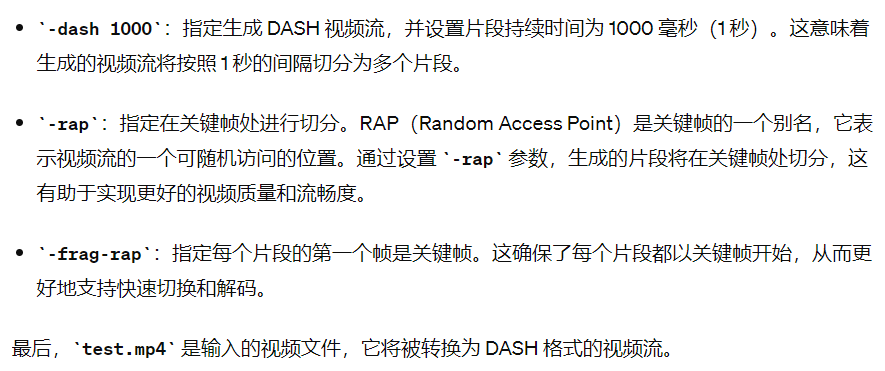
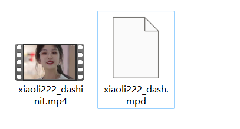
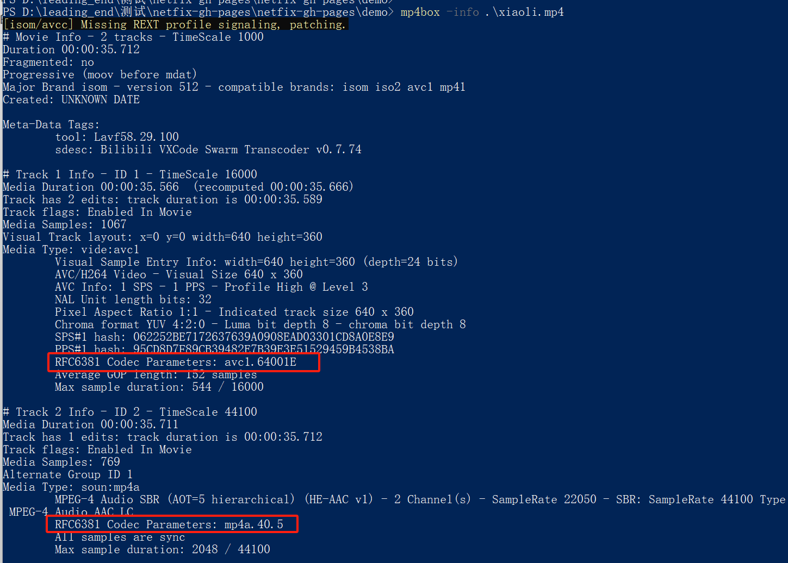
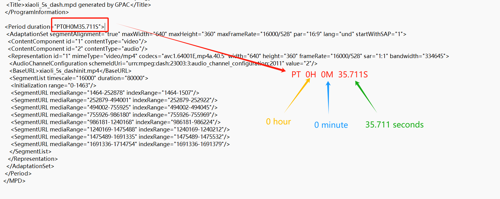

## MP4Box

安装：https://z197.com/blog/what-is-gpac-mp4box-using-tutorials.html

## 将视频分段

```bash
MP4Box -dash 1000 -rap -frag-rap test.mp4
```



执行：

```bash
MP4Box -dash 2000 -rap -frag-rap .\xiaoli222.mp4
```

会生成两个文件



一个 xiaoli222_dashinit.mp4 是分段后的视频，另一个是命令执行的信息。

```mpd
<?xml version="1.0"?>
<!-- MPD file Generated with GPAC version 2.2.1-rev0-gb34e3851-release-2.2 at 2024-04-07T13:34:10.193Z -->
<MPD xmlns="urn:mpeg:dash:schema:mpd:2011" minBufferTime="PT1.500S" type="static" mediaPresentationDuration="PT0H0M35.711S" maxSegmentDuration="PT0H0M5.000S" profiles="urn:mpeg:dash:profile:full:2011">
 <ProgramInformation moreInformationURL="http://gpac.io">
  <Title>xiaoli222_dash.mpd generated by GPAC</Title>
 </ProgramInformation>

 <Period duration="PT0H0M35.711S">
  <AdaptationSet segmentAlignment="true" maxWidth="640" maxHeight="360" maxFrameRate="16000/528" par="16:9" lang="und" startWithSAP="1">
   <ContentComponent id="1" contentType="video"/>
   <ContentComponent id="2" contentType="audio"/>
   <Representation id="1" mimeType="video/mp4" codecs="avc1.64001E,mp4a.40.5" width="640" height="360" frameRate="16000/528" sar="1:1" bandwidth="334645">
    <AudioChannelConfiguration schemeIdUri="urn:mpeg:dash:23003:3:audio_channel_configuration:2011" value="2"/>
    <BaseURL>xiaoli222_dashinit.mp4</BaseURL>
    <SegmentList timescale="16000" duration="32000">
     <Initialization range="0-1463"/>
     <SegmentURL mediaRange="1464-234318" indexRange="1464-1507"/>
     <SegmentURL mediaRange="234319-470729" indexRange="234319-234362"/>
     <SegmentURL mediaRange="470730-738405" indexRange="470730-470773"/>
     <SegmentURL mediaRange="738406-961391" indexRange="738406-738449"/>
     <SegmentURL mediaRange="961392-1222578" indexRange="961392-961435"/>
     <SegmentURL mediaRange="1222579-1452782" indexRange="1222579-1222622"/>
     <SegmentURL mediaRange="1452783-1672863" indexRange="1452783-1452826"/>
     <SegmentURL mediaRange="1672864-1714754" indexRange="1672864-1672907"/>
    </SegmentList>
   </Representation>
  </AdaptationSet>
 </Period>
</MPD>
```

其中的 `<SegmentURL> 标签的个数就是分段的个数`

## MP4Box的使用

```bash
mp4box -info .\xiaoli.mp4
```

能够获取视频的 mimecodec 信息



则 mimeCodec = 'video/mp4; codecs="avc1.64001E, mp4a.40.5"';


## mpd文件中的视频长度




## 参考：

https://stackoverflow.com/questions/22996665/unable-to-get-mediasource-working-with-mp4-format-in-chrome

https://stackoverflow.com/questions/16363167/html5-video-tag-codecs-attribute/48991053#48991053
